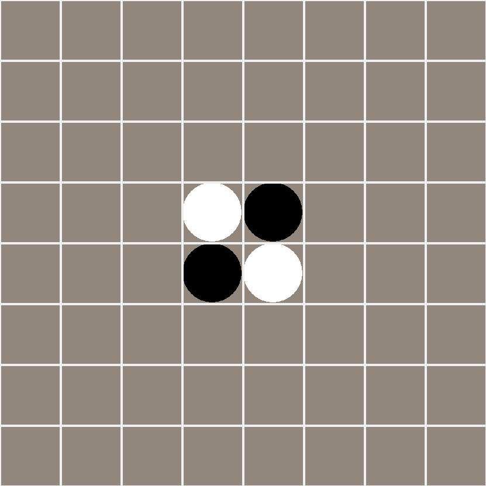

# Reversi (Othello)

Python implementation of Reversi(Othello) game agains human or computer.

To start the game, run:
    
    $ python game.py [width] [height] [player1] [player2] [difficulty] [weight_filepath]
  
  - width:      width of game field (default: 8) 
  - height:   height of game field (default: 8)
  - player1: human or AI (default: human)
  - player2: human or AI (default: AI)
  - difficulty:  game difficulty (maximum depth of state space search) (default: 5)
  - weight_filepath:  path to weight file. Can be obtained after training (optional).

AI training is performed using Particle Swarm Optimization algorithm.
To start training, run:

    $ python train.py [width] [height] [depth] [iterations] [swarmsize] [processes]
  
  - width:      width of game field (default: 4) 
  - height:   height of game field (default: 4)
  - depth:  maximum depth of state space search (default: 3)
  - iterations:  number of PSO iterations (default: 10).
  - swarmsize:  size of PSO swarm (default: 12).
  - processes:  number of processes to perform training (default: 12).
